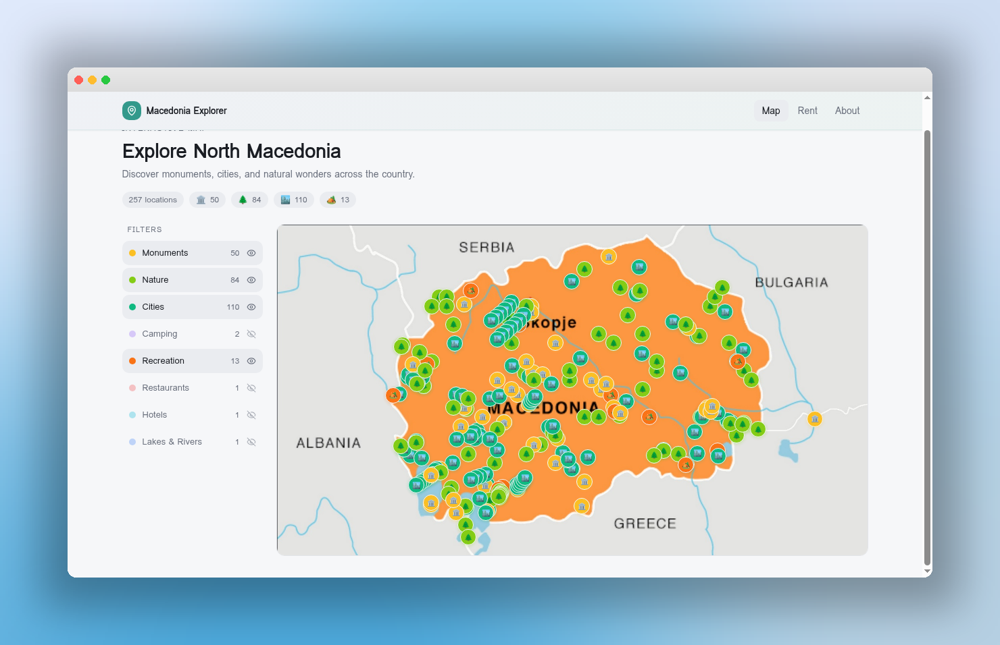

# Macedonia Explorer

Interactive map application for exploring North Macedonia — browse monuments, cities, nature spots, camping locations, and more.



## Features

- **Interactive map** with 257+ curated locations on a custom map
- **Category filters** — Monuments, Cities, Nature, Camping, Recreation, Restaurants, Hotels, Lakes & Rivers
- **Auto-detection** — new location types from data appear automatically in the legend
- **Location details** — hover any pin for name, description, coordinates, and Google Maps navigation
- **Responsive** — desktop sidebar filters, mobile-optimized chip filters
- **Modern UI** — frosted-glass navigation, cool-toned palette with teal accents, clean typography

## Tech Stack

- React 18 + TypeScript
- Vite
- Tailwind CSS + shadcn/ui
- React Router

## Getting Started

```bash
npm install
npm run dev
```

## Project Structure

```
src/
├── components/
│   ├── map/
│   │   ├── MapHeader.tsx       # Page title, stats, and badge pills
│   │   ├── MapFilters.tsx      # Desktop sidebar + mobile chip filters
│   │   └── MapPins.tsx         # Pin rendering and coordinate mapping
│   ├── CustomMap.tsx           # Main map orchestrator
│   ├── LocationTooltip.tsx     # Hover tooltip with navigation
│   └── Navigation.tsx          # Top nav bar
├── hooks/
│   └── useMapInteractions.ts   # Tooltip state and navigation logic
├── types/
│   └── location.ts             # Shared Location interface
├── constants/
│   └── locationTypes.ts        # Category config (color, icon, label)
├── data/
│   └── locations.json          # Location data
├── pages/
│   ├── Index.tsx
│   ├── About.tsx
│   └── Rent.tsx
└── index.css                   # Design tokens
```

## Adding Locations

Add entries to `src/data/locations.json`:

```json
{
  "name": "Location Name",
  "lat": 41.9981,
  "lng": 21.4254,
  "type": "monument",
  "description": "Brief description"
}
```

Register new types in `src/constants/locationTypes.ts` — they appear in the UI automatically.

## Design

- **Palette:** Cool blue-gray background with teal accent (`hsl(172, 50%, 40%)`)
- **Navigation:** Frosted glass with subtle gradient tint
- **Components:** Glass panels, badge pills, section cards
- **Tokens:** All colors defined as HSL CSS variables in `index.css`

## License

All rights reserved.
