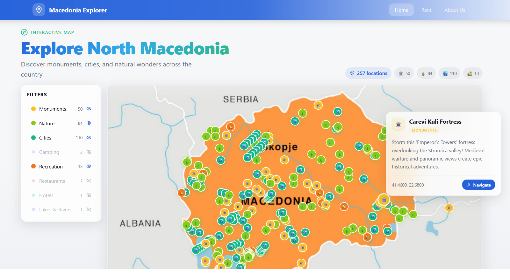

# 🗺️ Macedonia Explorer

An interactive map application for exploring **North Macedonia** — discover monuments, cities, nature spots, camping locations, restaurants, and more across the country.



## ✨ Features

- **Interactive Map** — Browse 250+ curated locations plotted on a custom map of North Macedonia
- **Dynamic Categories** — Filter by location type: Monuments 🏛️, Cities 🏙️, Nature 🌲, Camping ⛺, Recreation 🏕️, Restaurants 🍽️, Hotels 🏨, and more
- **Auto-Detection** — New location categories are automatically detected from the data
- **Location Details** — Click any pin to view name, description, and coordinates
- **Statistics Panel** — Real-time count of visible locations by category
- **Toggleable Legend** — Show/hide location types with a single click
- **Responsive Design** — Works on desktop, tablet, and mobile

## 🛠️ Tech Stack

| Technology | Purpose |
|---|---|
| **React 18** | UI framework |
| **TypeScript** | Type safety |
| **Vite** | Build tool & dev server |
| **Tailwind CSS** | Utility-first styling |
| **shadcn/ui** | Component library |
| **React Router** | Client-side routing |

## 🚀 Getting Started

### Prerequisites

- [Node.js](https://nodejs.org/) (v18+)
- npm or bun

### Installation

```bash
# Clone the repository
git clone <YOUR_GIT_URL>
cd macedonia-explorer

# Install dependencies
npm install

# Start development server
npm run dev
```

The app will be available at `http://localhost:5173`.

## 📁 Project Structure

```
src/
├── assets/              # Map images and static assets
├── components/
│   ├── CustomMap.tsx     # Main interactive map component
│   ├── LocationTooltip.tsx  # Tooltip for location details
│   └── Navigation.tsx   # Top navigation bar
├── constants/
│   └── locationTypes.ts # Location category configuration
├── data/
│   └── locations.json   # All location data (coordinates, names, types)
├── pages/
│   ├── Index.tsx        # Home page with map
│   ├── About.tsx        # About page
│   └── Rent.tsx         # Rental page
└── main.tsx             # App entry point
```

## 📍 Adding New Locations

Location data lives in `src/data/locations.json`. Each entry follows this format:

```json
{
  "name": "Location Name",
  "lat": 41.9981,
  "lng": 21.4254,
  "type": "monument",
  "description": "Brief description"
}
```

### Adding a New Category

1. Add locations with the new `type` value in `locations.json`
2. Register the category in `src/constants/locationTypes.ts`:

```ts
export const LOCATION_TYPES = {
  // ...existing types
  yourNewType: {
    color: '#hexcolor',
    icon: '🎯',
    label: 'Display Name'
  }
};
```

The legend and statistics will update automatically.

## 🌐 Deployment

This project is deployed via [Lovable](https://lovable.dev).

**Live URL:** [pin-point-stories.lovable.app](https://pin-point-stories.lovable.app)

## 📄 License

This project is private. All rights reserved.
